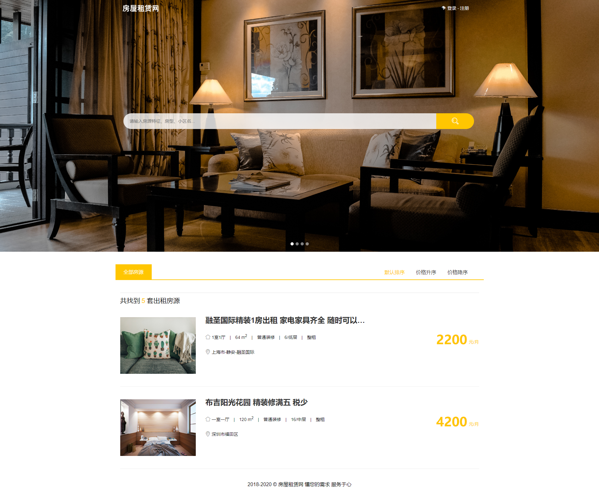
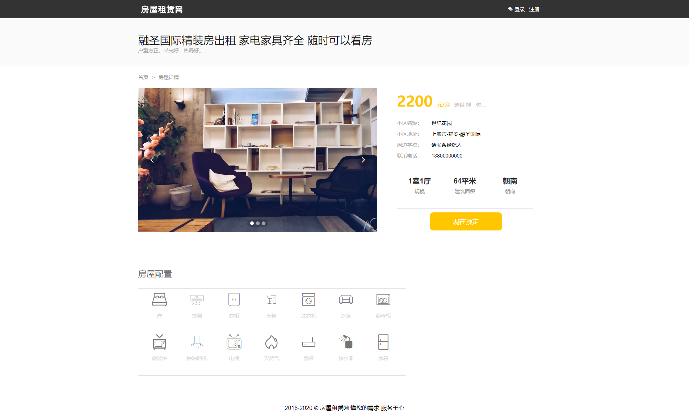

    <h1 align="center">房屋租赁系统</h1>

	
    
    
    

## 简介

> 房屋租赁系统，基于 Spring5.x 的实战项目。

## 特征

- <b>基本：</b>实现不同用户之间的收藏房源，与房东沟通
- <b>多用户：</b>普通用户与管理员各自都能发布房源信息
- <b>开发环境：</b>前端 `Layui`，后端 `Spring` `SpringMVC` `MyBatis`

- <b>· · ·</b>

## 环境

- <b>IntelliJ IDEA</b>

- <b>Mysql 5.7</b>

- <b>Tomcat 9.x</b>

- <b>JDK 1.8</b>

## 缩略图

## License

[MIT](http://opensource.org/licenses/MIT)

